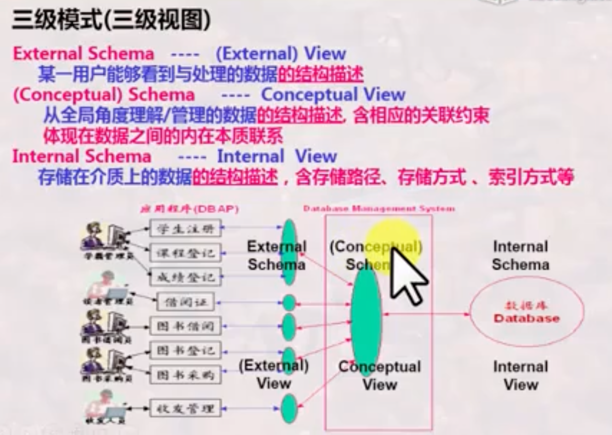
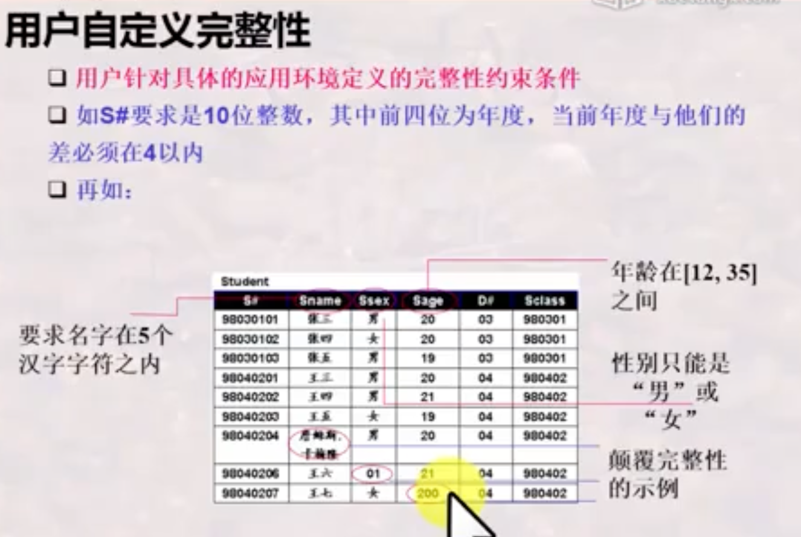

# 数据库系统

## 一、基本知识与关系模型

### 1、第一节

#### 什么是数据库？

数据库是有关系的数据的集合。对计算机来说包括存储数据并从中获取信息。

#### 什么是数据库系统？

#### 什么是数据库管理系统？（用户角度、系统角度）

##### 用户角度

交互式数据库语言：标准的SQL语言

嵌入式数据库语言：数据库语言可以嵌入到高级语言中

##### 系统角度（形式--构造--自动化）

#### 小节

### 2、第二节

#### 数据库系统的标准结构

##### 为什么要按照标准结构进行数据库系统的抽象？

#### 数据模型

数据模型是对模式的抽象，模式是对数据的抽象

#### 数据库系统的演变与发展

1、文件系统到数据库。DBMS解耦。文件系统以记录为单位，DBMS以数据项和记录集合为单位。

2、由层次、网状模型数据库到关系数据库。层次、网状有指针，只能逐一记录查询，而关系模型不依赖指针

3、由关系数据库到对象关系数据库、面向对象数据库（XML数据库、面向对象关系数据库）

4、由多种多样的数据库到多数据开放互联（ODBJ、JDBC）

5、由普通数据库到与各种先进技术结合所形成的新型数据库（如OA：DB + Management Information System）

#### 小节

### 3、关系模型之基本概念

#### 关系模型概述

#### 什么是关系

##### 候选码/候选键、主码/主键、主属性/非主属性、外码/外键 

#### 关系模型中的完整性约束

##### 实体完整性

##### 参照完整性

##### 用户自定义完整性

