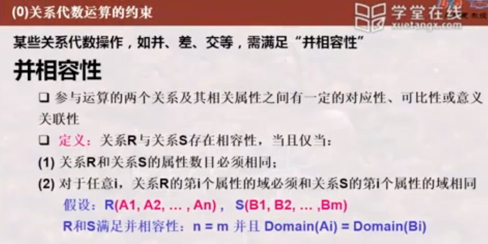
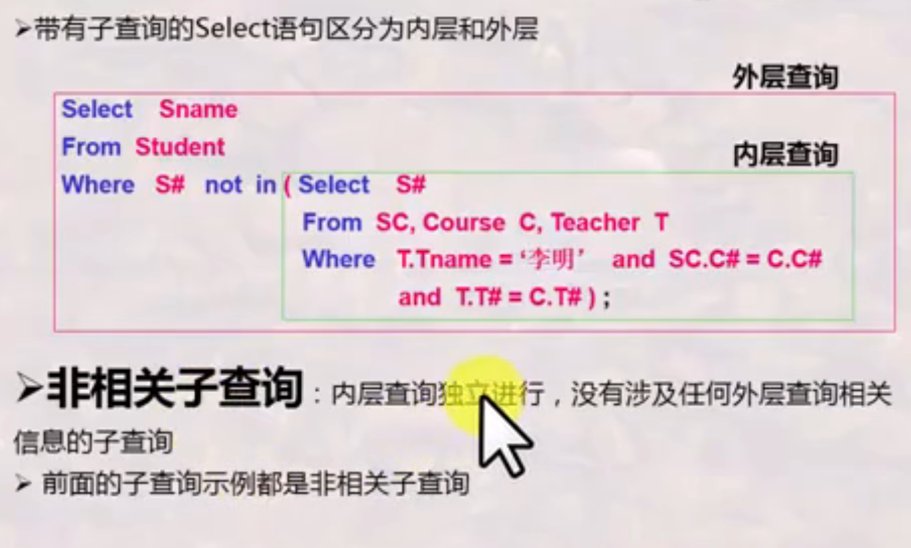
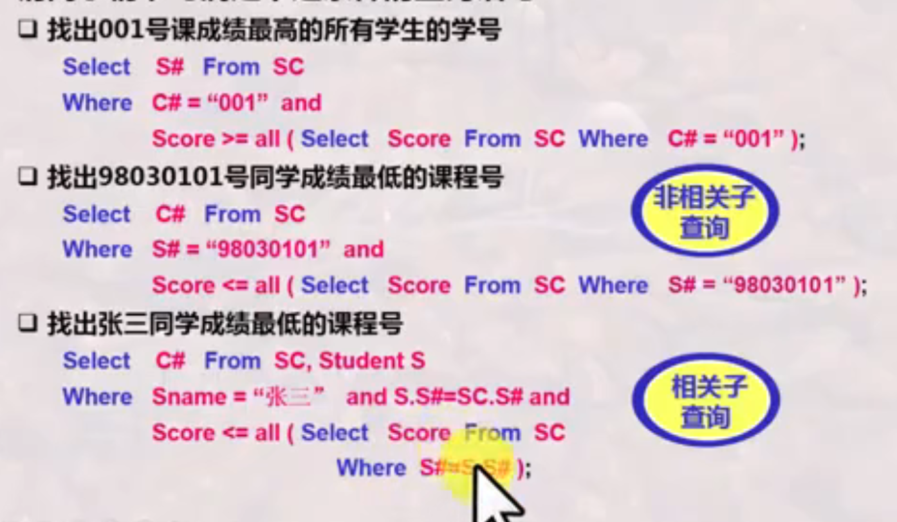
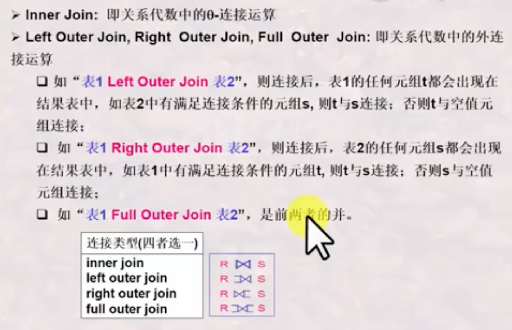
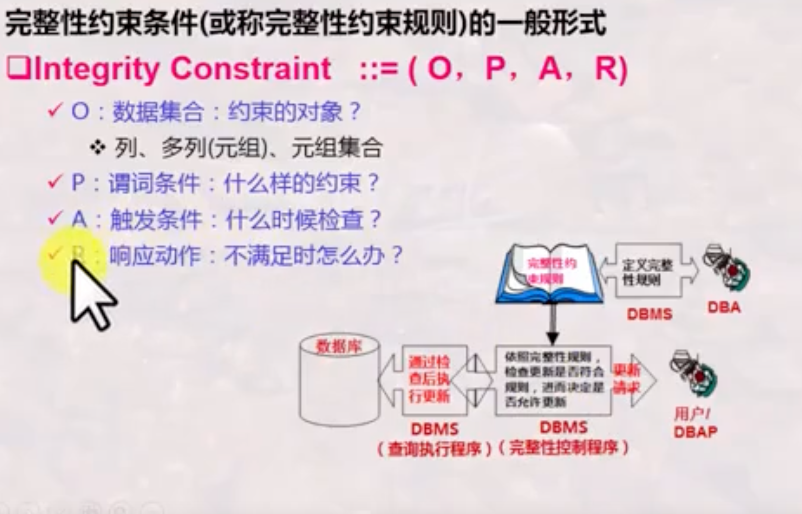
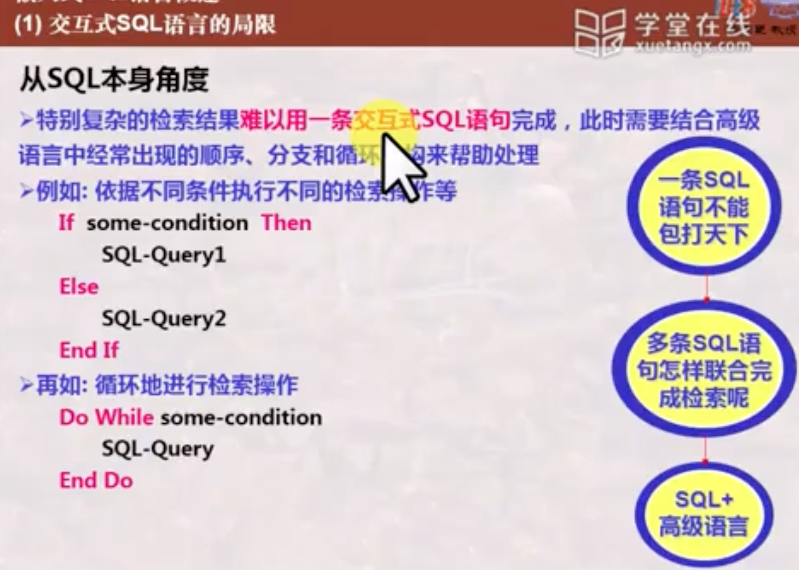
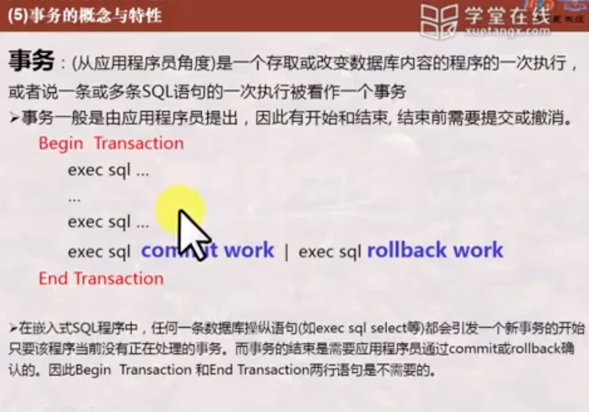
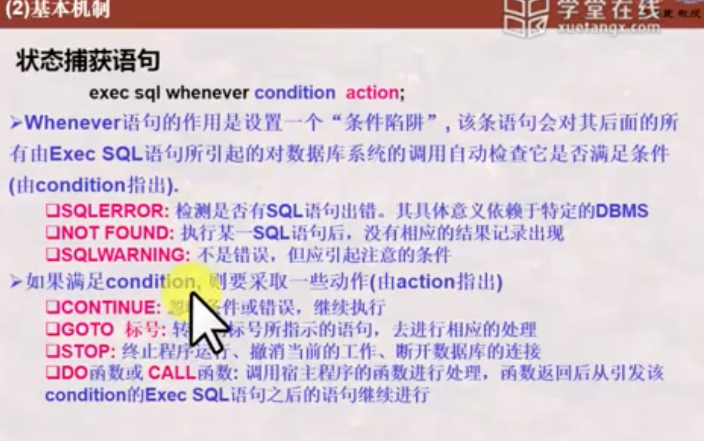

# 数据库系统

## 一、基本知识与关系模型

### 1、第一节

#### 什么是数据库？

数据库是有关系的数据的集合。对计算机来说包括存储数据并从中获取信息。

#### 什么是数据库系统？

#### 什么是数据库管理系统？（用户角度、系统角度）

##### 用户角度

交互式数据库语言：标准的SQL语言

嵌入式数据库语言：数据库语言可以嵌入到高级语言中

##### 系统角度（形式--构造--自动化）

#### 小节

### 2、第二节

#### 数据库系统的标准结构

##### 为什么要按照标准结构进行数据库系统的抽象？

#### 数据模型

数据模型是对模式的抽象，模式是对数据的抽象

#### 数据库系统的演变与发展

1、文件系统到数据库。DBMS解耦。文件系统以记录为单位，DBMS以数据项和记录集合为单位。

2、由层次、网状模型数据库到关系数据库。层次、网状有指针，只能逐一记录查询，而关系模型不依赖指针

3、由关系数据库到对象关系数据库、面向对象数据库（XML数据库、面向对象关系数据库）

4、由多种多样的数据库到多数据开放互联（ODBJ、JDBC）

5、由普通数据库到与各种先进技术结合所形成的新型数据库（如OA：DB + Management Information System）

#### 小节

### 3、关系模型之基本概念

#### 关系模型概述

#### 什么是关系

##### 候选码/候选键、主码/主键、主属性/非主属性、外码/外键 

#### 关系模型中的完整性约束

##### 实体完整性

##### 参照完整性

##### 用户自定义完整性

### 4、关系模型之关系代数

#### 关系代数之基本操作

#### 关系代数之扩展操作

#### 关系代数之组合与应用训练

#### 关系代数之复杂扩展操作

### 5、关系模式之元祖演算

#### 关系元祖演算

#### 关系域演算

##### 基于域演算所开发的QBE语言

#### 安全性

#### 三种关系运算的关系

## 二、数据库语言SQL

### 1、概览SQL语言

#### SQL语言概述

创建数据库分为两部，分别是DDL和DML

#### DDL

#### DML

#### 小节

### 2、SQL语言之复杂查询与视图

#### 子查询的运用

##### （Not） in

##### theta-Some/theta-All

##### （Not） Exists

#### 结果计算与聚集函数

#### 分组查询与分组过滤

#### 处理空值

#### 利用SQL语言实现关系代数操作

#### 视图及其应用

### 3、SQL语言与数据库完整性和安全性

#### 数据库完整性概念及分类

#### SQL语言之列约束与表约束（静态约束）

#### SQL语言之触发器--动态约束

#### 数据库安全性概念及分类

#### SQL语言之安全性实现

### 4、嵌入SQL

#### 嵌入式SQL语言概述

	

#### 变量声明与数据库连接

#### 数据集与游标

#### 可滚动游标与数据库的增删改

#### 状态捕获及错误处理机制

