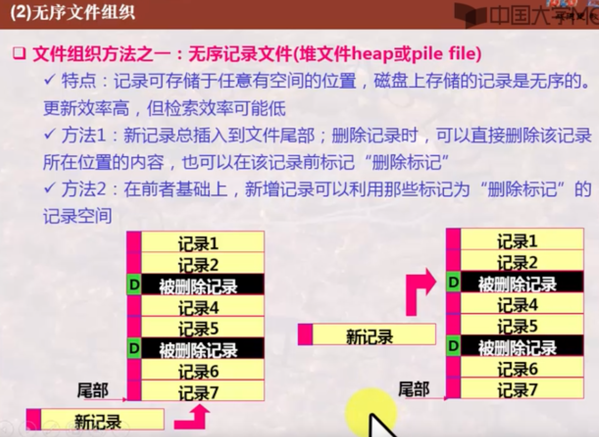
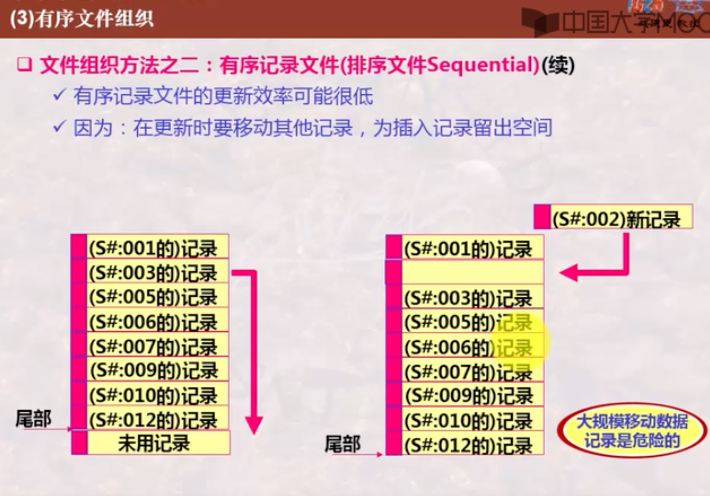
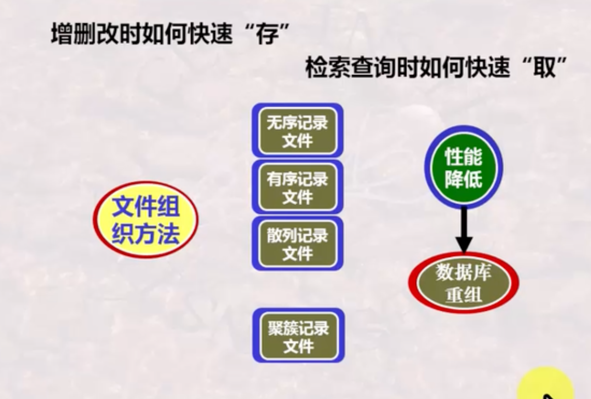
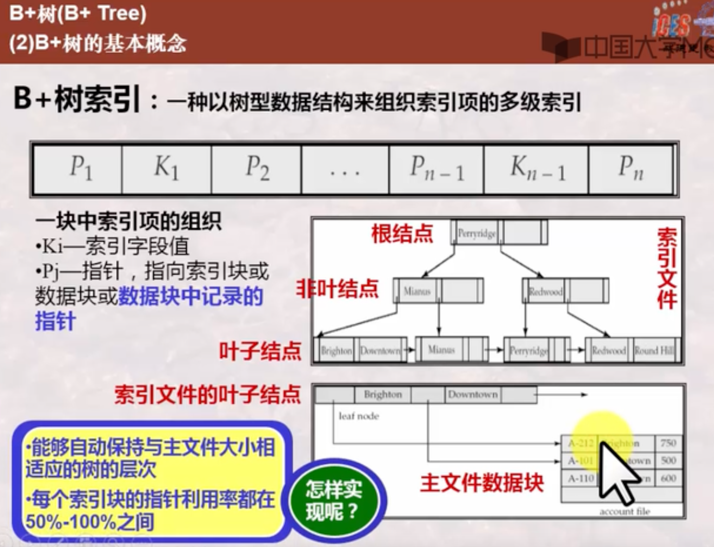
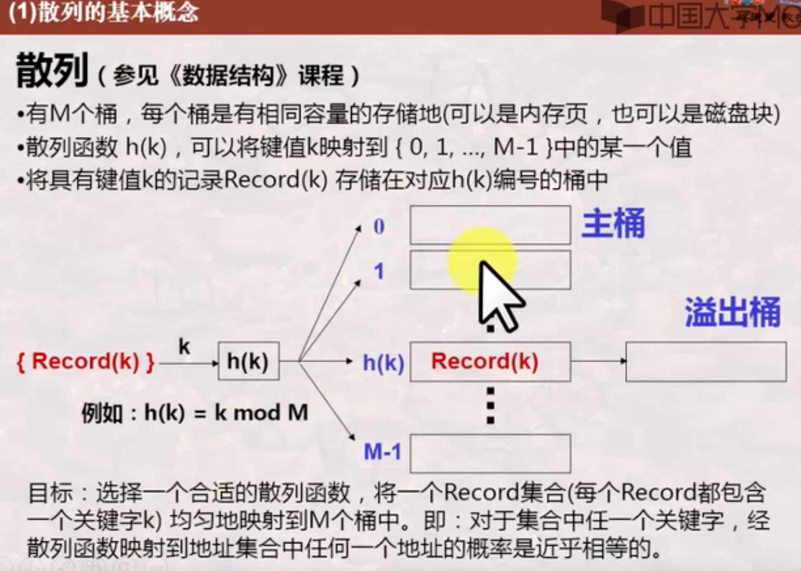
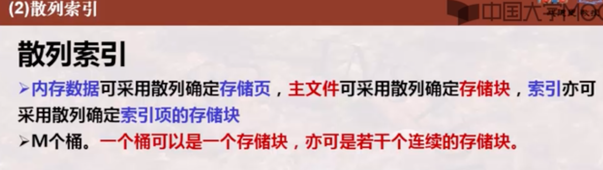

# 数据库系统（下）

## 四、 数据库管理系统实现技术

### 1、数据库物理存储

#### 基础回顾-计算机系统的存储体系

#### 磁盘的结构与特性

#### DBMS数据存储与查询实现的基本思想

#### 数据库之表和记录与磁盘块的映射

#### 数据库之文件组织方法

### 2、数据库索引

#### 为什么需要索引与什么是索引

#### 索引的简单分类

#### B+树索引

#### 散列索引

