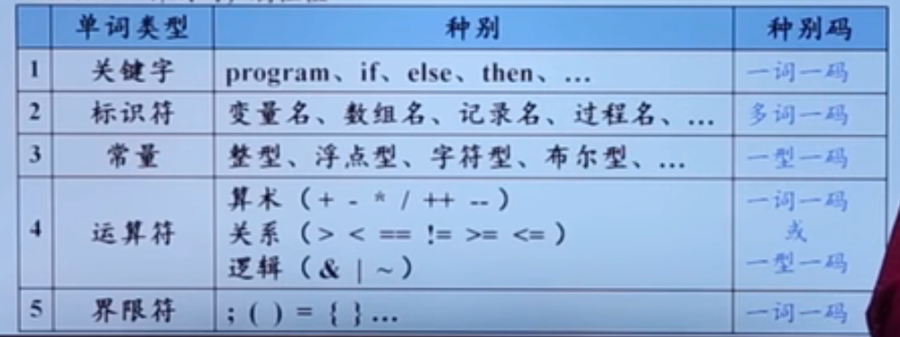
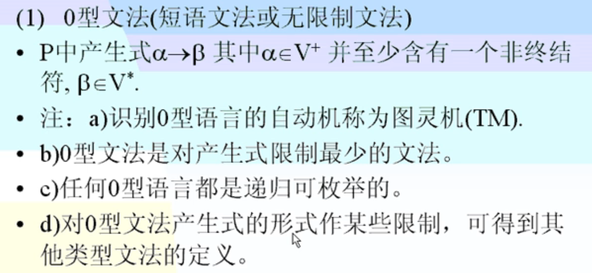
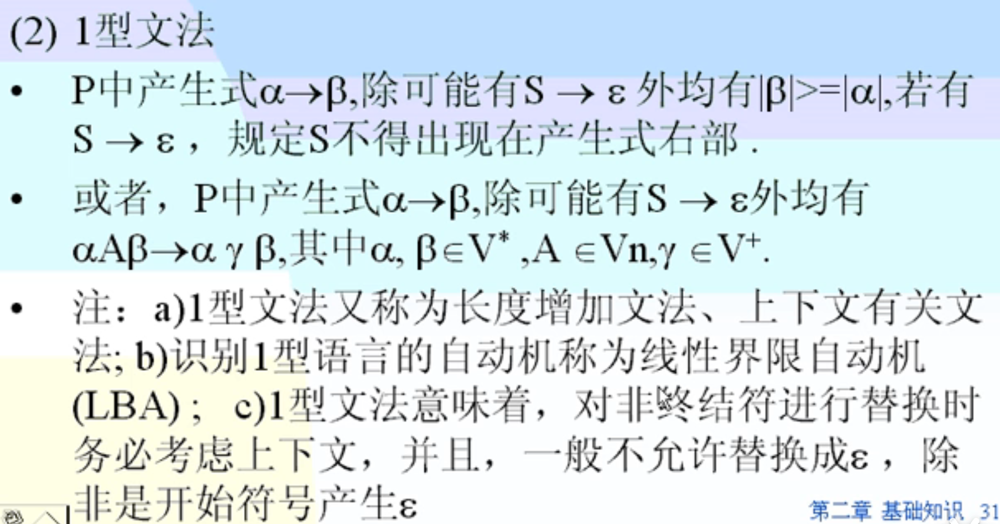
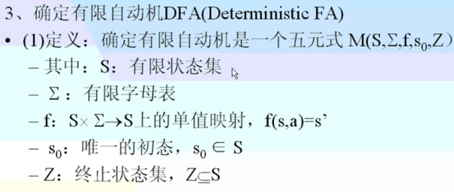

# 编译原理

## 一、绪论

### 1、什么是编译

#### 计算机程序设计语言及编译

| 语言     | 特征                                                         | 例子           |
| -------- | ------------------------------------------------------------ | -------------- |
| 机器语言 | 可以被计算机直接理解。与人类表达习惯相去甚远；难记忆；难编写，难阅读 | C706 0000 0002 |
| 汇编语言 | 引入助计符。依赖于特定机器，编写人员需要了解目标机的特性；编写效率低 | MOV X, 2       |
| 高级语言 | 类似于数学定义或自然语言的简介形式。接近人类表达习惯，效率高；不依赖特定机器 | x = 2          |

汇编：将汇编语言翻译成机器语言

编译：将高级语言（源语言）直接翻译成汇编语言或者机器语言（目标语言）

#### 程序设计语言的转换

翻译是指在不改变语义的情况下， 将源程序转化为目标程序的过程。翻译有两种实现：**编译**和**解释**。

编译是专指高级语言转变为低级语言。（整本书翻译）

解释是指接受一句高级语言输入，然后交由计算机执行，然后再接受下一句。（同声传译）其不产生目标程序，一边解释一遍执行。优点是直观易懂，结构简单，易于人机交互，但是效率低。

编译分为两个阶段的转换（编译--运行）和三个阶段的转换（编译--汇编--运行）。（C语言可能产生.obj以及link的过程）

#### 编译器在语言处理系统中的位置

预处理器：把存储在不同文件中的源程序聚合在一起；把被称为宏的缩写语句转化为原始语句

可重定位：在内存中存放的起始位置L不是固定的。`起始位置+相对地址=绝对地址`

加载器：修改可重定位地址；将修改后的指令和数据放到内存中的适当位置

链接器：大型程序经常需要分为多个部分进行编译，所以可重定位的机器代码需要与其他可重定位目标程序（包括库文件）进行链接，这一工作由链接器进行处理。此外，还负责解决外部内存地址问题（外部引用）

### 2、编译系统的结构

词法分析：分析词性。介词、名词、动词。。。

语法分析：识别各类短语，形成句子的结构。介词短语、名词短语。。。

语义分析：根据名词短语与谓语之间的关系，确定语义，得到中间代码形式

####  编译器的各阶段

在进行语法分析时，可以同时进行语义分析，这一过程称为语法制导翻译。在具体实现中，语法分析、语义分析以及中间代码生成可以放在一起实现。

### 3、词法分析/扫描

从左到右逐行扫描源程序的字符，识别出各个单词，确定单词的类型。将识别出的单词转换成统一的机内表示----词法单元（token）形成。token：`<种别码，属性值>`

关键字、运算符、界限符：一词一码

常量：一型一码

标识符：多词一码

描述词法规则的有效工具是**正则式**和**有限自动机**

### 4、语法分析

语法分析器从词法分析器输出的token序列中识别出各类短语，并构造语法分析树。语法分析树描述了句子的语法结构。

在词法分析的基础上，根据语言的**语法规则（又称为文法，规定单词如何构成短语、语句、过程和程序。可以用BNF【巴斯科范式】`A::=B|C`）**，把单词符号组成各类的语法单位：短语、子句、语句、过程、程序。

语法分析的方法：**推导**（derive）【最左推导、最右推导】和**归约**（reduce）【最右归约、最左归约】

### 5、语义分析

 主要作用：

1）收集标识符的属性信息。这些信息被放在符号表（一种数据结构）中

| 标识符属性信息   | 例子                     |
| ---------------- | ------------------------ |
| 种属（Kind）     | 简单变量、符合变量、过程 |
| 类型（Type）     | 整型、布尔型             |
| 存储位置、长度   |                          |
| 值               |                          |
| 作用域           |                          |
| 参数和返回值信息 |                          |

2）语义检查。

变量或过程未经声明就使用；变量或过程名重复声明；运算分量类型不匹配；操作符与操作数之间类型不匹配

### 6、中间代码生成与编译器后端

#### 中间代码生成

分为两个阶段的工作：1、对每种语法范畴进行静态语义检查；2、若语义正确，就进行中间代码的翻译。

中间代码形式有**四元式**、**三元式**、**逆波兰式**

有两种表示形式：三地址码、语法结构树/语法数（注意：与之前语法分析中的语法分析树不同）

三地址码由类似于汇编语言的指令序列组成，每个指令最多有三个操作数（变量）。

三地址指令的数据结构表示有四元式、三元式、间接三元式

三地址指令序列唯一确定了运算完成的顺序

#### 目标代码生成

以源程序的中间代码形式输入，映射为目标语言。为程序中使用的变量合理分配寄存器

有三种形式：

绝对指令代码（可直接执行的exe）、汇编指令代码（汇编程序运行）、可重定位指令代码（C语言中，需要link）

#### 代码优化

改进代码所进行的等价程序变换，使其运行得更快一些、占用空间更少一些。包括机器无关代码优化（中间代码）和机器相关代码优化（目标代码） 

原则：等价变换

主要方面：公共子表达式提取、合并已知量、删除无用语句、循环优化（循环内的东西都是必须的 ）等。

### 7、表格与表格管理

表格作用：记录源程序的各种信息以及编译过程中的各种状况。表格主要是编译前三个阶段生成的。

符号表：词法分析中产生，登记源程序中的常量名、变量名、数组名、过程名等，记录他们的性质、定义和引用情况。

常数表与标号表：词法分析中产生

入口名表：登记过程的层号，分程序符号表入口等

中间代码表

### 8、出错处理

出错报告用户。错误类型有语法错误（词法分析和语法分析）和语义错误（语义分析阶段）。逻辑错误在编译阶段不检查。

### 9、遍

 对源程序或者源程序中间结果从头到尾扫描一次，加工后生成新的中间结果或目标代码的过程。遍与阶段的含义毫无关系。

一遍扫描：以语法分析为中心

多遍扫描（在内存许可的情况下，尽可能少）

-优点：节省内存空间，提高目标代码质量，使编译的逻辑结构清晰

-缺点：编译时间较长

### 10、编译程序生成

1、直接用机器语言编写编译程序

2、用汇编语言编写编译程序（编译程序核心部分常用汇编语言编写）

3、用高级语言编写编译程序（普遍采用的方法）

4、自编译

5、编译工具：LEX（词法分析）、YACC（自动生成LALR分析表）

6、移植：同种语言的编译程序在不同类型的机器之间移植

### 11、编译程序的构造

需要非常了解源语言、目标语言、编译方法

## 二、编译基础知识

### 1、编译基础知识

#### 高级语言

程序语言是一个记号系统（语义+语法）

#### 语法

任何语言程序都可以看成是一定字符集上的字符串。语法使得这串字符形成一个形式上正确的程序。`语法=词法规则+语法规则`。这两者定义了程序的形式结构，是判断输入字符串是否构成一个形式上正确的程序的依据。

**词法规则**：规定了字母表中那些字符串是单词符号（语言中具有独立意义的最基本结构）。单词符号一般包括常数、标识符、基本字、算符、界限符等。可以用**正规式**和**有限自动机理论**来描述词法结构和进行词法分析

**语法规则**：规定如何从单词符号来形成语法单位（表达式、子句、语句、函数、过程、程序）。大多数程序语言使用**上下文无关文法**来描述语法规则。

#### 语义

对于一个语言来说，还需要语义规则。目前大多数编译程序使用**属性文法**的语法制导翻译来分析语义。

### 2、字母表与符号串

#### 相关概念

1、字母表：是符号的非空有穷集合。用**Σ**、**V**表示

2、符号：语言中最基本的不可再分的单位

3、字符串：字母表中符号组成的有穷序列。不含任何符号的串称作空串，记作**ε**

4、句子：字母表上符合某种规则构成的串

5、语言：字母表上句子的集合

注：约定用a，b，c表示符号；用希腊字母表示符号串；用A，B，C表示集合

#### 符号串集合的运算

1、连接（乘积）运算

2、字母表的闭包和正闭包

### 3、文法与语言的关系

#### 文法的概念

文法是描述语言的语法结构的形式规则。

##### 相关概念

1、非终结符：出现在规则的左边（箭头的左边），用<>括起来，表示一定语言概念的词。用VN表示

2、终结符：语言中不可再分割的字符串（包括单个字符组成的串）。终结符是组成句子的基本单位。用VT表示

3、开始符号（识别符号）：表示所定义的语法范畴的非终结符。

4、产生式：定义符号串之间关系的一组语法规则。形式：A->α

5、推导：推导从开始符号开始，使用产生式的右边取代左边，最终产生语言的一个句子的过程。最左（右）推导：每次使用一个规则，以其右边取代符号串最左（右）非终结符。最左推导和最右推导称为**规范推导**。

6、归约：推导的逆过程。从给定源语言的句子开始，通过规则的左边取代右边，最终达到开始符号的过程。

7、句型、句子和语言

除了最后的结果是句子不是句型，其他中间过程都是句型。语言都是由终结符VT构成的集合（就是说最后经过推导得到的句子可能是非常非常多的，这个集合就称为语言）。

8、文法规则的递归定义

非终结符的定义中包含了非终结符自身。使用文法的递归定义要谨慎。

9、元语言符号

用来说明文法符号之间关系的符号，如->   |

#### 文法与语言的形式定义

#### 由语言构造文法

观察法

#### 文法的简化

#### 构造无空串产生式的上下文无关文法

### 4、语法树与文法的二义性

#### 语法树

表示语言的句子结构。非常清楚直观，容易判断文法的二义性

#### 文法二义性

## 三、词法分析

词法分析是编译的第一阶段，在单词的级别上分析和翻译源程序。理论基础就是有限自动机理论，该理论与正规文法、正规式之间存在一一对应的关系

### 1、正规文法和有限自动机

#### 正规文法、正规式、正规集的区别与联系

正规文法和正规式是描述一种语言的两种不同形式。正规文法与正规式存在一一对应的关系，即一种正规文法对应着唯一一个正规式。两者可以相互转换。正规集就是由正规文法或者正规式定义的正规语言的集合。

正规文法转化为正规式通过联立方程组的方式来得到，这需要记住两个定理。

而正规式得到正规文法需要借助有限自动机。

#### 有限自动机

有限自动机是一种识别装置，能够准确识别正规集。为词法分析提供工具。有限自动机模型可以用**状态转换图**（状态用结点，读入符号用边表示，终态用两个圈圈表示）或者**状态转化矩阵**表示。矩阵表示便于计算机计算，但是状态图更直观。

有限自动机可以分为**确定有限自动机（DFA）**和**不确定有限自动机（NFA）**

1）确定有限自动机

2）不确定有限自动机

##### NFA转化为DFA

##### DFA简化过程

#### 正规式与有限自动机之间的关系

